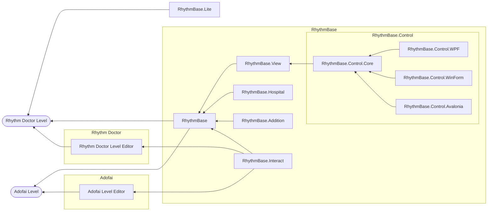
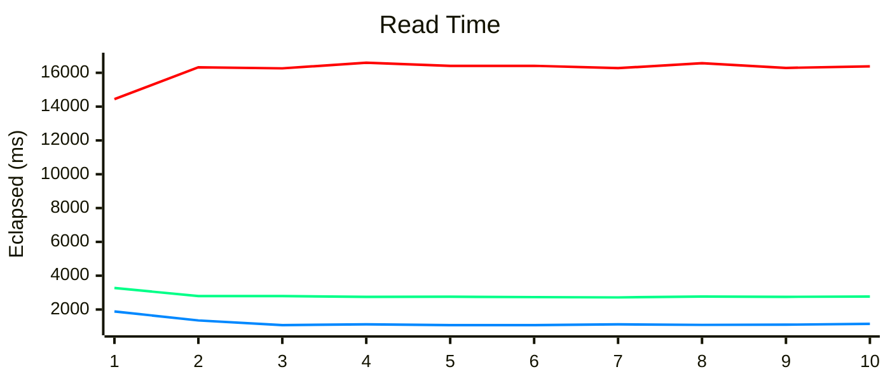
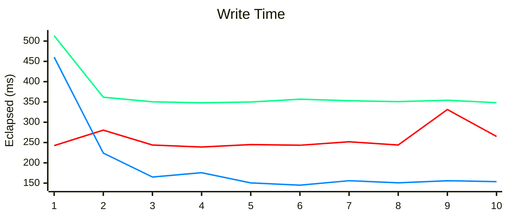

  
  
  

# RhythmBase

This project serves **Rhythm Doctor** and **A Dance of Fire and Ice** level developers, aiming to provide a more systematic and intuitive level editing medium for developers.  
Thanks to the Rhythm Doctor fan community for their support of this project.  
You can see examples [here](/RhythmBase.Test/Tutorial.cs).

## Special Thanks

- [0x4D2](https://github.com/0x4D25F2) for amounts of testing and feedback.
- [mfgujhgh](https://github.com/mfgujhgh) for algorithm guidance.

| Project             | Description                                         | Status           | Link                                                                       | 
|---------------------|-----------------------------------------------------|------------------|:---------------------------------------------------------------------------|
| RhythmBase          | Core library for level editing.                     | WIP              | **You are here**                                                           |
| RhythmBase.View     | Draw all Rhythm Doctor event elements in SkiaSharp. | WIP              | [Go there](https://github.com/OLDRedstone/RhythmBase.View)                 |
| RhythmBase.Addition | Extensions for levels.                              | *Not disclosed*  | -                                                                          |
| RhythmBase.Interact | Interact with Level editor.                         | *Not disclosed*  | -                                                                          |
| RhythmBase.Hospital | Judgement logic for levels.                         | *Not disclosed*  | -                                                                          |
| RhythmBase.Lite     | Lightweight version of RhythmBase.                  | WIP              | [Go there](https://github.com/RDCN-Community-Developers/RhythmToolkitLite) |
| RhythmBase.Control  | Custom controls.                                    | *Not disclosed*  | -                                                                          |

### Read/Write Speed Comparison

This section compares the read and write speeds for the level *The Power of Terry* (`the-powe-S7V1kg9RWYK.rdzip`).  
Operating System: Windows 25H2 26200.7462  
CPU: 12th Gen Intel® Core™ i7-12650H  
RAM: 16GB  

**🟥Rhythm Doctor Level Editor v1.0.3/r42(r65) Windows da9f047**
- Utilizes `scrEditor.Decode` to open the `main.rdlevel` file and `scrEditor.Encode` by pressing `Ctrl + S` in the Editor Interface.  

**🟩RhythmBase v1.3.4 .NET Standard 2.0**
- Uses `RDLeve.FromFile` to read the complete `rdzip` file and `RDLevel.SaveToFile` to save it as an `rdlevel` file.  
- Tested in .NET Framework 4.8.9221.0

**🟦RhythmBase v1.3.4 .NET 8.0**
- Uses `RDLeve.FromFile` to read the complete `rdzip` file and `RDLevel.SaveToFile` to save it as an `rdlevel` file.  
- Tested in .NET 8.0.11

### Summary of Statistics

The performance benchmark results demonstrate substantial efficiency improvements across different RhythmBase versions compared to the Rhythm Doctor Level Editor v1.0.3/r42:

**RhythmBase v1.3.4 on .NET 8.0 (Optimal Performance):**
- **Read Speed:** Approximately **14.2x faster**, with an average read time of 1,149.30 ms versus the Rhythm Doctor Level Editor's 16,324.79 ms.
- **Write Speed:** Approximately **1.9x faster**, achieving an average write time of 144.90 ms compared to the Rhythm Doctor Level Editor's 280.58 ms.

**RhythmBase v1.3.4 on .NET Standard 2.0 (Moderate Performance):**
- **Read Speed:** Approximately **5.9x faster** than the Rhythm Doctor Level Editor, with an average read time of 2,760.54 ms.
- **Write Speed:** Approximately **1.4x slower** than the Rhythm Doctor Level Editor, with an average write time of 368.58 ms (a slight performance trade-off).

These results highlight the significant performance advantages of leveraging modern .NET frameworks, particularly .NET 8.0, for level file operations, especially for read-intensive workflows.

