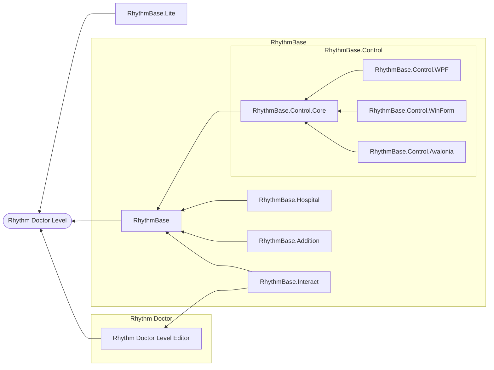

  
  
  

# RhythmBase

This project serves **Rhythm Doctor** and **A Dance of Fire and Ice** level developers, aiming to provide a more systematic and intuitive level editing medium for developers.  
Thanks to the Rhythm Doctor fan community for their support of this project.  
You can see examples [here](/RhythmBase.Test/Tutorial.cs).

## Special Thanks

- [0x4D2](https://github.com/0x4D25F2) for amounts of testing and feedback.
- [mfgujhgh](https://github.com/mfgujhgh) for alogrithm guidance.

| Project             | Description                        | Status           | Link                                                                       | 
|---------------------|------------------------------------|------------------|----------------------------------------------------------------------------|
| RhythmBase          | Core library for level editing.    | WIP              | **You are here**                                                           |
| RhythmBase.Addition | Extensions for levels.             | *Not disclosed*  | -                                                                          |
| RhythmBase.Interact | Interact with Level editor.        | *Not disclosed*  | -                                                                          |
| RhythmBase.Hospital | Judgement logic for levels.        | *Not disclosed*  | -                                                                          |
| RhythmBase.Lite     | Lightweight version of RhythmBase. | WIP              | [Go there](https://github.com/RDCN-Community-Developers/RhythmToolkitLite) |
| RhythmBase.Control  | Custom controls.                   | *Not disclosed*  | -                                                                          |

