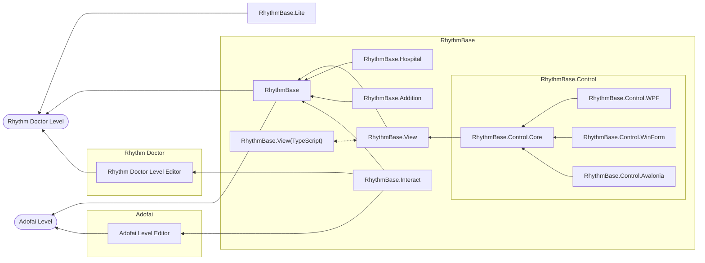
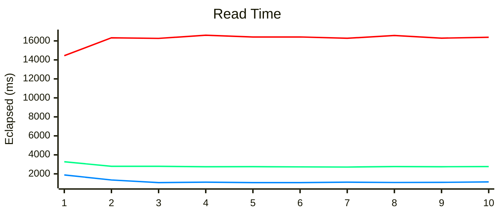
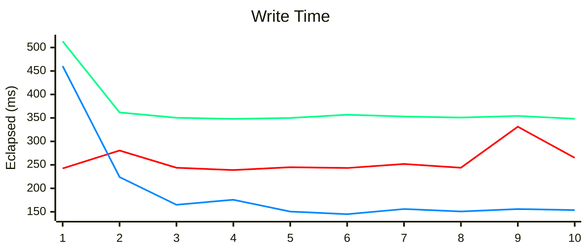

<p align="center">
  <a href="/LICENSE"></a>
  <a href="https://www.nuget.org/packages/RhythmBase/"></a>
  
</p>


> If you find this project helpful, consider sponsoring via [爱发电 (Chinese mainland)](https://afdian.com/a/obugs) or [Ko-fi (Global)](https://ko-fi.com/obugs)!  


# RhythmBase

#### \[ English | [中文](./README_cn.md) \]

This project primarily serves **Rhythm Doctor** and **A Dance of Fire and Ice** level developers, aiming to provide an engine-agnostic, high-performance, systematic, and intuitive level editing proxy development library for developers.  
Thanks to the Rhythm Doctor fan community for their support of this project.  
You can see examples [here](/RhythmBase.Test/Tutorial.cs).

## Special Thanks
- Project Maintenance
    - [0x4D2](https://github.com/0x4D25F2) for substantial testing and feedback.
    - [mfgujhgh](https://github.com/mfgujhgh) for algorithm guidance.
- Sponsors
    - [来因洛特 | layinloty](https://space.bilibili.com/406743035)
    - [狗小白 | Dogbai](https://space.bilibili.com/1129425006)
    - [只能用宽判的屑 | kuanpan](https://space.bilibili.com/1928620300)
    - [mfgujhgh](https://space.bilibili.com/1369651)

| Project             | Description                                         | Status           | Link                                                                       | 
|---------------------|-----------------------------------------------------|------------------|:---------------------------------------------------------------------------|
| RhythmBase          | Core library for level editing proxy.                     | Maintained       | **You are here**                                                           |
| RhythmBase.View     | Draw all Rhythm Doctor events with SkiaSharp and TypeScript DOM versions. | Under Development | [Go there](https://github.com/OLDRedstone/RhythmBase.View)                 |
| RhythmBase.Addition | Extensions for the core library.                              | *Not disclosed*  | -                                                                          |
| RhythmBase.Interact | Interact with game level editors.                         | *Not disclosed*  | -                                                                          |
| RhythmBase.Hospital | Level review, hints, and assistance features.                         | *Not disclosed*  | -                                                                          |
| RhythmBase.Lite     | Lightweight version of RhythmBase.                  | Under Development | [Go there](https://github.com/RDCN-Community-Developers/RhythmToolkitLite) |
| RhythmBase.Control  | UI control library for level editing proxy.                                    | *Not disclosed*  | -                                                                          |



### Core Features

#### Comprehensive Event System Support

RhythmBase provides a strongly-typed event model for both Rhythm Doctor and A Dance of Fire and Ice, covering all official event types and Adofai's advanced filter system, also providing compatibility for potential new event models in the future. Through type checking and intelligent hints, it eliminates runtime errors at the source.

#### Intelligent Event Processing

- **Event Discovery and Querying** - Flexible LINQ query support makes it easy to filter events by type or condition
- **Automatic Relationship Management** - Event binding system automatically maintains parent-child relationships without manual tree structure handling
- **Timeline Generation** - Built-in timeline management tools support advanced temporal sequences and control logic

#### Rich Toolkit

- **RichText Support** - Complete rich text syntax parsing and code generation for dialogue and title events
- **Easing Function Library** - Contains all in-game easing curves with support for custom interpolation functions
- **RDCode Integration** - Native support for Rhythm Doctor's code system, including syntax analysis and expression evaluation
- **Macro Event System** - Generate complex event sequences through code while maintaining full compatibility with original levels

### Read/Write Performance Comparison

This section compares the read and write speeds for the level *The Power of Terry* (`the-powe-S7V1kg9RWYK.rdzip`).  
Operating System: Windows 25H2 26200.7462  
CPU: 12th Gen Intel® Core™ i7-12650H  
RAM: 16GB  

**🟥Rhythm Doctor Level Editor v1.0.3/r42(r65) Windows da9f047**
- Utilizes `scrEditor.Decode` to open the `main.rdlevel` file and `scrEditor.Encode` by pressing `Ctrl + S` in the Editor Interface.  

**🟩RhythmBase v1.3.4 .NET Standard 2.0**
- Uses `RDLeve.FromFile` to read the complete `rdzip` file and `RDLevel.SaveToFile` to save it as an `rdlevel` file.  
- Tested in .NET Framework 4.8.9221.0

**🟦RhythmBase v1.3.4 .NET 8.0**
- Uses `RDLeve.FromFile` to read the complete `rdzip` file and `RDLevel.SaveToFile` to save it as an `rdlevel` file.  
- Tested in .NET 8.0.11





### Platform and Language Interoperability

#### Cross-Platform Support

Thanks to .NET Standard 2.0 compatibility, RhythmBase runs seamlessly on multiple platforms:

- **Windows** - Via .NET Framework 4.6.1+ or .NET Core/8.0+
- **Linux** - Via .NET Core/8.0+ (with Mono compatibility)
- **macOS** - Via .NET Core/8.0+

This means regardless of your operating system, you get a consistent development experience and API interface, avoiding common cross-platform incompatibility issues.

#### Multi-Language Support

Thanks to cross-language interoperability technologies in the .NET ecosystem, you can call RhythmBase from different programming languages:

**C#, F#, VB.NET, C++/CLI** - Native support

**Python** - Via the [pythonnet](https://github.com/pythonnet/pythonnet) library, you can use RhythmBase directly in Python, suitable for:
- Writing automation scripts
- Batch processing level files
- Integrating with Python data analysis tools

Here are concrete code examples:

**C# Example** - Standard .NET development approach:

```cs
using RhythmBase.Global.Components.Vector;
using RhythmBase.Global.Settings;
using RhythmBase.RhythmDoctor.Components;
using RhythmBase.RhythmDoctor.Events;

LevelReadOrWriteSettings settings = new()
{
	UnreadableEventsHandling = UnreadableEventHandling.Store,
};
RDLevel rdlevel = RDLevel.Default;

foreach (Row row in rdlevel.Rows)
{
	MoveRow moveRow = new MoveRow()
	{
		Beat = new RDBeat(3),
		Position = new RDPointE(10, 20),
	};
}

rdlevel.SaveToFile("111.rdlevel");
```

**Python Example** - Using pythonnet to bridge .NET and Python ecosystems:

```py
# Assembly loading operations
import pythonnet
pythonnet.load('coreclr')
import clr
clr.AddReference('RhythmBase')

from RhythmBase.Global.Components.Vector import *
from RhythmBase.Global.Settings import *
from RhythmBase.RhythmDoctor.Components import *
from RhythmBase.RhythmDoctor.Events import *

settings = LevelReadOrWriteSettings()
settings.UnreadableEventsHandling = UnreadableEventHandling.Store
rdlevel = RDLevel.Default

for row in rdlevel.Rows:
    move_row = MoveRow()
    move_row.Beat = RDBeat(3)
    move_row.Position = RDPointE(10,20)

rdlevel.SaveToFile('111.rdlevel')
```

This flexibility enables RhythmBase to integrate into various toolchains and workflows, regardless of your preferred programming language or development environment.

### Advanced Features

#### Error Handling and Resilience

RhythmBase provides flexible error handling mechanisms:
- **Unreadable Event Mode** - When encountering unrecognized events, choose to store raw data rather than throwing exceptions
- **Custom Error Handling** - Full control over how to handle various exceptional situations

#### Type Safety and Compile-Time Checking

Benefits of C#'s strong type system:
- **Intellisense Support** - IDE automatically suggests all available event properties and methods
- **Refactoring Support** - Automatically updates related code when modifying event structures
- **Compile-Time Verification** - Eliminates runtime type errors

#### Performance Optimization

- **Zero-Copy Serialization** - Efficient binary format handling
- **Incremental Processing** - Stream processing support for large level files

#### Extensible Design

- **Partial Classes and Extension Methods** - Easy to extend functionality without modifying core library
- **Interface-Driven Design** - Interface-based event classification for custom processing logic
- **Plugin Architecture Foundation** - Solid foundation for building toolsets and extensions

#### Rich Data Structures and Algorithms

- **Generic Vector System** - Support for multiple-precision point, size, and rectangle structures (floating-point, integer, expression, optional value)
- **Curve Interpolation Engine** - Support for easing functions and custom curves for animation and numerical computation
- **Timeline Management System** - Automatic generation and maintenance of level timelines supporting complex animation and event sequences
- **Collections and Iterators** - Efficient collection implementations with LINQ query and lazy loading support

#### Complete Text and Serialization Support

- **RichText Engine** - Strongly-typed rich text structures supporting styles, events, and range operations
- **JSON Serialization** - High-performance serialization based on System.Text.Json supporting complex nested structures