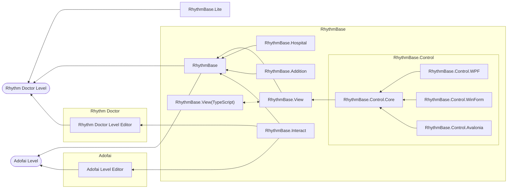
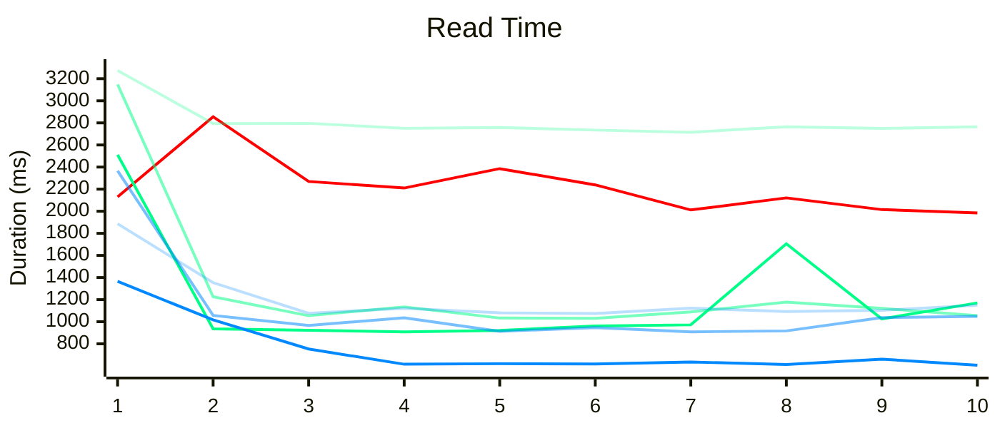
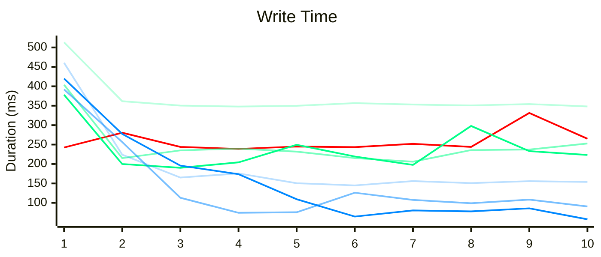

<p align="center">
  <a href="/LICENSE"></a>
  <a href="https://www.nuget.org/packages/RhythmBase/"></a>
  
</p>

> If you find this project helpful, consider sponsoring via [爱发电 (Chinese mainland)](https://afdian.com/a/obugs) or [Ko-fi (Global)](https://ko-fi.com/obugs)!  

# RhythmBase

#### \[ English | [中文](./README.zh-cn.md) \]

This project primarily serves **Rhythm Doctor** and **A Dance of Fire and Ice** level developers, aiming to provide an engine-agnostic, high-performance, systematic, and intuitive level editing proxy development library for developers.  
Thanks to the Rhythm Doctor fan community for their support of this project.  
You can see examples [here](/RhythmBase.Test/Tutorial.cs).

## Special Thanks
- Project Maintenance
    - [0x4D2](https://github.com/0x4D25F2) for substantial testing and feedback.
    - [mfgujhgh](https://github.com/mfgujhgh) for algorithm guidance.
- Sponsors
    - [来因洛特 | layinloty](https://space.bilibili.com/406743035)
    - [狗小白 | Dogbai](https://space.bilibili.com/1129425006)
    - [只能用宽判的屑 | kuanpan](https://space.bilibili.com/1928620300)
    - [mfgujhgh](https://space.bilibili.com/1369651)

| Project             | Description                                                          | Status            | Link                                                                         | 
|---------------------|----------------------------------------------------------------------|-------------------|:-----------------------------------------------------------------------------|
| RhythmBase          | Core library for level editing proxy.                                | Maintained        | **You are here**                                                             |
| RhythmBase.View     | Draw all Rhythm Doctor event icons (include TypeScript DOM version). | Under Development | [Go there](https://github.com/OLDRedstone/RhythmBase.View)                   |
| RhythmBase.Addition | Extensions for the core library.                                     | Under Development | [Go there](https://github.com/RDCN-Community-Developers/RhythmBase.Addition) |
| RhythmBase.Interact | Interact with game level editors.                                    | *Not disclosed*   | -                                                                            |
| RhythmBase.Hospital | Level review, hints, and assistance features.                        | *Not disclosed*   | -                                                                            |
| RhythmBase.Lite     | Lightweight version of RhythmBase.                                   | Under Development | [Go there](https://github.com/RDCN-Community-Developers/RhythmToolkitLite)   |
| RhythmBase.Control  | UI control library for level editing proxy.                          | *Not disclosed*   | -                                                                            |


```mermaid
flowchart RL
RBLite[RhythmBase.Lite]
subgraph RD[Rhythm Doctor]
  RDLE[Rhythm Doctor Level Editor]
end
subgraph AD[Adofai]
  ADLE[Adofai Level Editor]
end
RDL([Rhythm Doctor Level])
ADL([Adofai Level])
subgraph RBTitle[RhythmBase]
  RB[RhythmBase]
  RBAdd[RhythmBase.Addition]
  RBInt[RhythmBase.Interact]
  RBHos[RhythmBase.Hospital]
  RBV[RhythmBase.View]
  RBVts["RhythmBase.View(TypeScript)"]
  subgraph RBC[RhythmBase.Control]
    RBCCore[RhythmBase.Control.Core]
    RBCWPF[RhythmBase.Control.WPF]
    RBCWF[RhythmBase.Control.WinForm]
    RBCAva[RhythmBase.Control.Avalonia]
  end
end

RBLite ---> RDL
RBCWPF & RBCWF & RBCAva --> RBCCore --> RBV
RBV & RBHos & RBAdd & RBInt --> RB ---> RDL & ADL
RBInt ---> RDLE --> RDL
RBInt ---> ADLE --> ADL
RBV <-.-> RBVts
```

## Core Features

- **Comprehensive Event System Support** — Strongly-typed event models for Rhythm Doctor and Adofai, covering all official event types and Adofai's advanced filter system, with compatibility for future event models.
- **Intelligent Event Processing** — Flexible LINQ queries, automatic relationship management, and built-in timeline generation tools.
- **RichText & Dialogue Components** — Complete rich-text syntax parsing and code generation for dialogue and title events.
- **Easing Function Library** — All in-game easing curves with support for custom interpolation and curve fitting.
- **Cross-Platform** — Based on .NET Standard 2.0 / .NET 8.0, supporting Windows, Linux, and macOS.
- **Multi-Language Interop** — Besides C#/F#/VB.NET, RhythmBase can be called from Python via [pythonnet](https://github.com/pythonnet/pythonnet).

## Quick Start

```powershell
dotnet add package RhythmBase
```

```cs
using RhythmBase.RhythmDoctor.Components;
using RhythmBase.RhythmDoctor.Events;

// Read a level
using var level = RDLevel.FromFile("level.rdlevel");

// Add an event
level.Add(new Comment() { Text = "hello", CustomTab = Tab.Windows, Y = 2 });

// Save
level.SaveToFile("out.rdlevel");
```

## Performance

Using the level *The Power of Terry* (`the-powe-S7V1kg9RWYK.rdzip`) as a benchmark, RhythmBase achieves read/write speeds several times faster than the official level editor under .NET 8.0.  
- :red_square: Game Editor
- :green_square: .NET Standard 2.0 on .NET Framework 4.8
- :blue_square: .NET 8.0 on .NET 8.0


```mermaid
---
config:
    xyChart:
        height: 300
    themeVariables:
        xyChart:
            plotColorPalette: '#F00, #0F84, #0F88,  #0F8, #08F4, #08F8, #08F'
---
xychart
  title "Read Time"
    y-axis "Duration (ms)"
    %% RDLE
    line [2130.5224, 2855.4669, 2269.7906, 2210.3916, 2385.5643, 2238.7013, 2011.8578, 2121.1231, 2014.9036, 1984.7555]
    %% RDTK .NET Standard 2.0 v1.3.4
    line [3273.9261, 2793.1168, 2796.0169, 2750.7386, 2757.9804, 2734.5127, 2715.0270, 2765.0712, 2749.9744, 2764.9854]
    %% RDTK .NET Standard 2.0 v1.3.9
    line [3148.9088,1226.1298,1054.2334,1134.9715,1033.4164,1030.4823,1088.7369,1178.1487,1120.97,1055.3118]
    %% RDTK .NET Standard 2.0 v1.3.10
    line [2511.4484,935.1044,922.5633,908.0549,921.5173,961.0245,971.9857,1705.2193,1025.6835,1170.5473]
    %% RDTK .NET 8.0 v1.3.4
    line [1887.2656, 1353.3896, 1076.3732, 1121.0746, 1080.6883, 1074.4476, 1122.7722, 1091.6990, 1103.6302, 1149.2975]
    %% RDTK .NET 8.0 v1.3.9
    line [2367.0337,1056.9628,966.5576,1035.8415,913.1249,946.951,908.2692,917.0895,1036.6879,1048.7651]
    %% RDTK .NET 8.0 v1.3.10
    line [1365.457,1017.3662,753.053,615.3958,620.0609,617.4589,635.7308,612.3335,661.5626,605.837]
```

```mermaid
---
config:
    xyChart:
        height: 300
    themeVariables:
        xyChart:
            plotColorPalette: '#F00, #0F84, #0F88,  #0F8, #08F4, #08F8, #08F'
---
xychart
  title "Write Time"
    y-axis "Duration (ms)"
    %% RDLE
    line [242.5163, 280.5837, 243.9327, 238.8927, 244.9178, 243.3303, 251.8815, 243.9217, 331.3641, 265.0274]
    %% RDTK .NET Standard 2.0 v1.3.4
    line [513.1026, 361.6694, 350.3818, 347.8336, 349.8539, 356.7689, 353.0014, 350.7653, 354.2552, 348.2180]
    %% RDTK .NET Standard 2.0 v1.3.9
    line [403.8953,215.1384,235.0083,239.653,231.9253,215.1407,205.9433,235.8352,237.2161,252.8412]
    %% RDTK .NET Standard 2.0 v1.3.10
    line [378.2349,199.9493,190.2174,204.2167,249.4367,219.3135,197.8157,297.8816,233.1203,223.2512]
    %% RDTK .NET 8.0 v1.3.4
    line [460.3911, 224.0186, 165.0900, 175.7229, 150.6010, 144.8973, 155.9880, 150.8031, 155.9035, 153.7161]
    %% RDTK .NET 8.0 v1.3.9
    line [391.9549,256.5255,113.1473,74.3901,75.7604,126.1112,107.5059,99.014,108.391,90.731]
    %% RDTK .NET 8.0 v1.3.10
    line [419.8573,277.4102,195.8157,173.8777,109.3214,64.7145,80.4896,77.9989,85.8971,57.5985]
```

## Documentation

- [Full Tutorial (Chinese)](docs/Tutorial.zh-cn.md)
- [Full Tutorial (English)](docs/Tutorial.md)

## About This Project

This project was originally named `RhythmToolkit`, with the goal of developing a few small tools for *Rhythm Doctor* to simplify level processing. As the project gradually matured, its direction increasingly shifted toward becoming a foundational framework for other tools, and support for *A Dance of Fire and Ice* (Adofai) was also added. For these reasons, the project was renamed to `RhythmBase`, and the more tool-oriented content was migrated to other repositories. Of course, you can still call it `RDTK` for short!
