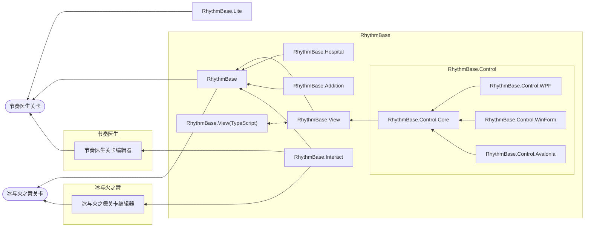
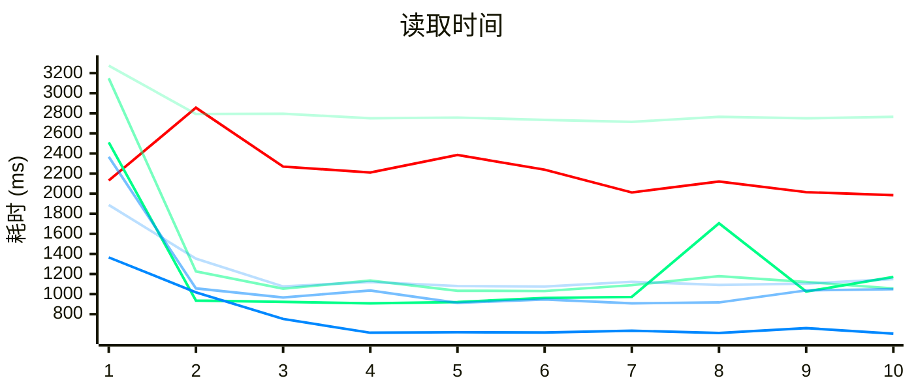
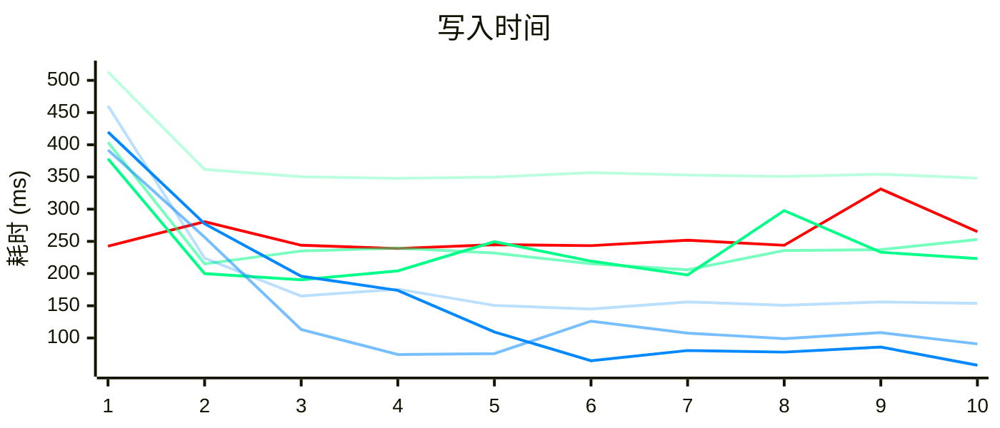

<p align="center">
  <a href="/LICENSE"></a>
  <a href="https://www.nuget.org/packages/RhythmBase/"></a>
  
</p>

> 如果您觉得这个项目对您有帮助，可以考虑通过[爱发电（中国大陆）](https://afdian.com/a/obugs)或 [Ko-fi（国际）](https://ko-fi.com/obugs)进行赞助！

# RhythmBase

#### \[ [English](./README.md) | 中文 \]

本项目面向 **节奏医生（Rhythm Doctor）（主要）** 和 **冰与火之舞（A Dance of Fire and Ice）** 的关卡开发者，旨在为开发者提供独立于游戏引擎的、更高性能、系统化、直观的关卡编辑代理开发库。\
感谢节奏医生玩家社区对本项目的支持。\
您可以在[这里](/RhythmBase.Test/Tutorial.cs)查看示例。

## 特别感谢
- 项目维护
    - [0x4D2](https://github.com/0x4D25F2) 提供了大量测试和反馈。
    - [mfgujhgh](https://github.com/mfgujhgh) 提供了算法指导。
- 赞助
    - [来因洛特 | layinloty](https://space.bilibili.com/406743035)
    - [狗小白 | Dogbai](https://space.bilibili.com/1129425006)
    - [只能用宽判的屑 | kuanpan](https://space.bilibili.com/1928620300)
    - [mfgujhgh](https://space.bilibili.com/1369651)

| 项目                | 描述                                              | 状态     | 链接                                                                     | 
|--------------------|----------------------------------------------------|----------|:-------------------------------------------------------------------------|
| RhythmBase          | 关卡编辑代理核心库。                              | 维护中   | **您在这里**                                                             |
| RhythmBase.View     | 绘制所有节奏医生事件。（包括 TypeScript DOM 版本）| 开发中   | [前往](https://github.com/OLDRedstone/RhythmBase.View)                   |
| RhythmBase.Addition | 为核心库扩展功能。                                | 开发中   | [前往](https://github.com/RDCN-Community-Developers/RhythmBase.Addition) |
| RhythmBase.Interact | 与游戏关卡编辑器交互。                            | *未公开* | -                                                                        |
| RhythmBase.Hospital | 关卡的审核、提示、辅助等功能。                    | *未公开* | -                                                                        |
| RhythmBase.Lite     | RhythmBase 的轻量版本。                           | 开发中   | [前往](https://github.com/RDCN-Community-Developers/RhythmToolkitLite)   |
| RhythmBase.Control  | 关卡代理 UI 控件库。                              | *未公开* | -                                                                        |



## 核心特性

- **完整的事件系统支持** — 为《节奏医生》和《冰与火之舞》提供强类型事件模型，涵盖所有官方事件类型及 Adofai 高级滤镜系统，兼容未来新事件模型。
- **智能事件处理** — 灵活的 LINQ 查询、自动关系管理、内置时间线生成工具。
- **RichText 与对话组件** — 完整的富文本语法解析和代码生成，用于对话和标题事件。
- **缓动函数库** — 包含游戏全部缓动曲线，支持自定义插值与曲线拟合。
- **跨平台** — 基于 .NET Standard 2.0 / .NET 8.0，支持 Windows、Linux、macOS。
- **多语言调用** — 除 C#/F#/VB.NET 外，可通过 [pythonnet](https://github.com/pythonnet/pythonnet) 在 Python 中调用。

## 快速开始

```powershell
dotnet add package RhythmBase
```

```cs
using RhythmBase.RhythmDoctor.Components;
using RhythmBase.RhythmDoctor.Events;

// 读取关卡
using var level = RDLevel.FromFile("level.rdlevel");

// 添加事件
level.Add(new Comment() { Text = "hello", CustomTab = Tab.Windows, Y = 2 });

// 保存
level.SaveToFile("out.rdlevel");
```

## 性能

以关卡 *The Power of Terry* (`the-powe-S7V1kg9RWYK.rdzip`) 为基准，在 .NET 8.0 环境下 RhythmBase 的读写速度可达官方关卡编辑器的数倍。  
- :red_square: 游戏编辑器
- :green_square: .NET framework 4.8 下运行 .NET standard 2.0
- :blue_square: .NET 8.0 下运行 .NET 8.0




## 文档

- [完整使用教程 (中文)](docs/Tutorial.zh-cn.md)
- [Full Tutorial (English)](docs/Tutorial.md)

## 关于这个项目

这个项目最初命名为 `RhythmToolkit`，目标是为《节奏医生》开发一些简化关卡处理的小工具。随着项目逐渐完善，发展方向逐步偏向成为其他工具的基础框架，并扩展支持了《冰与火之舞》（Adofai）的关卡模型。基于以上原因，项目更名为 `RhythmBase`，工具性质的内容迁移至其他仓库。当然，你也可以简称它为 `RDTK`！
