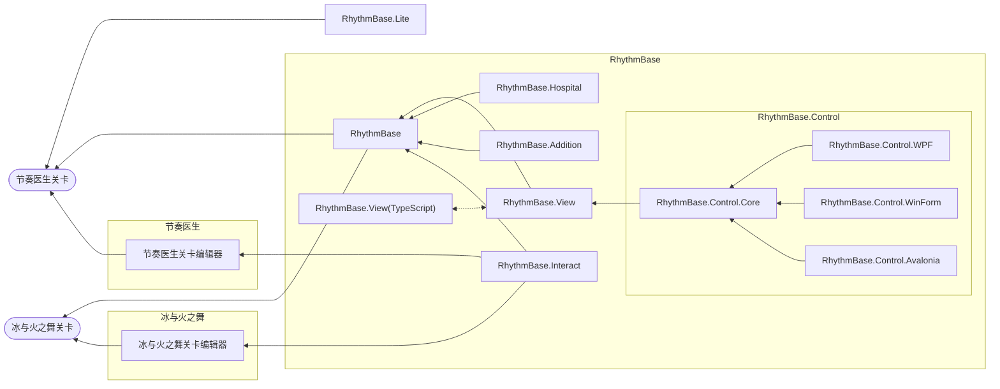
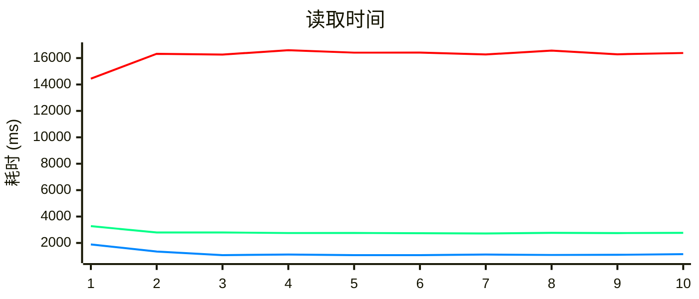
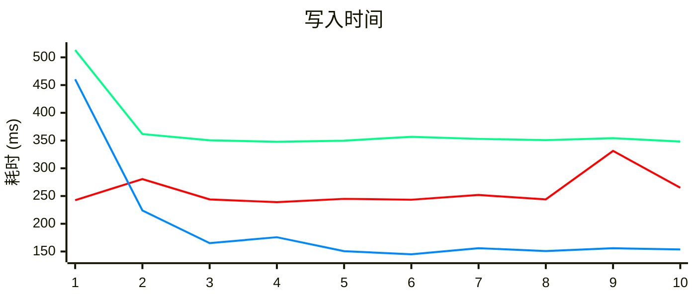

<p align="center">
  <a href="/LICENSE"></a>
  <a href="https://www.nuget.org/packages/RhythmBase/"></a>
  
</p>


> 如果您觉得这个项目对您有帮助，可以考虑通过[爱发电（中国大陆）](https://afdian.com/a/obugs)或 [Ko-fi（国际）](https://ko-fi.com/obugs)进行赞助！


# RhythmBase

#### \[ [English](./README.md) | 中文 \]

本项目面向 **节奏医生（Rhythm Doctor）（主要）** 和 **冰与火之舞（A Dance of Fire and Ice）** 的关卡开发者，旨在为开发者提供独立于游戏引擎的、更高性能、系统化、直观的关卡编辑代理开发库。  
感谢节奏医生玩家社区对本项目的支持。  
您可以在[这里](/RhythmBase.Test/Tutorial.cs)查看示例。

## 特别感谢
- 项目维护
    - [0x4D2](https://github.com/0x4D25F2) 提供了大量测试和反馈。
    - [mfgujhgh](https://github.com/mfgujhgh) 提供了算法指导。
- 赞助
    - [来因洛特 | layinloty](https://space.bilibili.com/406743035)
    - [狗小白 | Dogbai](https://space.bilibili.com/1129425006)
    - [只能用宽判的屑 | kuanpan](https://space.bilibili.com/1928620300)
    - [mfgujhgh](https://space.bilibili.com/1369651)

| 项目                | 描述                                      | 状态       | 链接                                                                        | 
|--------------------|------------------------------------------|-----------|:---------------------------------------------------------------------------|
| RhythmBase          | 关卡编辑代理核心库。                            | 维护中     | **您在这里**                                                                |
| RhythmBase.View     | 绘制所有节奏医生事件。包含 SkiaSharp 和 TypeScript DOM 两个版本。      | 开发中     | [前往](https://github.com/OLDRedstone/RhythmBase.View)                      |
| RhythmBase.Addition | 为核心库扩展功能。                              | *未公开*  | -                                                                          |
| RhythmBase.Interact | 与游戏关卡编辑器交互。                          | *未公开*  | -                                                                          |
| RhythmBase.Hospital | 关卡的审核、提示、辅助等功能。                              | *未公开*  | -                                                                          |
| RhythmBase.Lite     | RhythmBase 的轻量版本。                    | 开发中     | [前往](https://github.com/RDCN-Community-Developers/RhythmToolkitLite)      |
| RhythmBase.Control  | 关卡代理 UI 控件库。                                | *未公开*  | -                                                                          |



### 核心特性

#### 完整的事件系统支持

RhythmBase 为《节奏医生》和《冰与火之舞》提供了强类型的事件模型，涵盖所有官方事件类型及 Adofai 的高级滤镜系统，也提供了对未来可能有的新事件模型的兼容。通过类型检查和智能提示，从源头消除了运行时错误。

#### 智能的事件处理

- **事件发现与查询** - 灵活的 LINQ 查询支持，轻松筛选特定类型或条件的事件
- **自动关系管理** - 事件绑定系统自动维护父子关系，无需手动处理复杂的树结构
- **时间线生成** - 内置的时间线管理工具，支持高级的时间序列和控制逻辑

#### 丰富的工具库

- **RichText 支持** - 完整的富文本语法解析和代码生成，用于对话和标题事件
- **缓动函数库** - 包含游戏全部缓动曲线，支持自定义插值函数
- **RDCode 集成** - 原生支持节奏医生代码系统，含语法分析和表达式求值
- **宏事件系统** - 通过代码生成复杂事件序列，同时保持与原版关卡的完全兼容

### 读写性能对比

本节对比了关卡 *The Power of Terry* (`the-powe-S7V1kg9RWYK.rdzip`) 的读写速度。  
操作系统：Windows 25H2 26200.7462  
CPU：12th Gen Intel® Core™ i7-12650H  
内存：16GB  

**🟥节奏医生关卡编辑器 v1.0.3/r42(r65) Windows da9f047**
- 使用 `scrEditor.Decode` 打开 `main.rdlevel` 文件，并通过在编辑器界面按 `Ctrl + S` 调用 `scrEditor.Encode`。  

**🟩RhythmBase v1.3.4 .NET Standard 2.0**
- 使用 `RDLeve.FromFile` 读取完整的 `rdzip` 文件，并使用 `RDLevel.SaveToFile` 将其保存为 `rdlevel` 文件。  
- 在 .NET Framework 4.8.9221.0 中测试

**🟦RhythmBase v1.3.4 .NET 8.0**
- 使用 `RDLeve.FromFile` 读取完整的 `rdzip` 文件，并使用 `RDLevel.SaveToFile` 将其保存为 `rdlevel` 文件。  
- 在 .NET 8.0.11 中测试





#### 统计摘要

性能基准测试结果显示，与节奏医生关卡编辑器 v1.0.3/r42 相比，不同版本的 RhythmBase 在效率上有显著提升：

**RhythmBase v1.3.4 在 .NET 8.0 上（最佳性能）：**
- **读取速度：** 约快 **14.2 倍**，平均读取时间为 1,149.30 毫秒，而节奏医生关卡编辑器为 16,324.79 毫秒。
- **写入速度：** 约快 **1.9 倍**，平均写入时间为 144.90 毫秒，相比节奏医生关卡编辑器的 280.58 毫秒。

**RhythmBase v1.3.4 在 .NET Standard 2.0 上（中等性能）：**
- **读取速度：** 比节奏医生关卡编辑器快约 **5.9 倍**，平均读取时间为 2,760.54 毫秒。
- **写入速度：** 比节奏医生关卡编辑器慢约 **1.4 倍**，平均写入时间为 368.58 毫秒（性能略有折衷）。

这些结果突显了利用现代 .NET 框架（特别是 .NET 8.0）进行关卡文件操作的显著性能优势，尤其是在读取密集型工作流程中。

### 平台、语言互通

#### 跨平台支持

由于适配了 .NET Standard 2.0 版本，RhythmBase 可以在多个平台上无缝运行：

- **Windows** - 通过 .NET Framework 4.6.1+ 或 .NET Core/8.0+
- **Linux** - 通过 .NET Core/8.0+（使用 Mono 兼容库）
- **macOS** - 通过 .NET Core/8.0+

这意味着无论您使用的是什么操作系统，都能获得几乎一致的开发体验和 API 接口，避免了跨平台开发中常见的不兼容问题。

#### 多语言支持

得益于 .NET 生态中的跨语言互操作技术，您可以使用不同编程语言来调用 RhythmBase：

**C#、F#、VB.NET、C++/CLI** - 原生支持

**Python** - 通过 [pythonnet](https://github.com/pythonnet/pythonnet) 库，您可以在 Python 中直接使用 RhythmBase，适合：
- 编写自动化脚本
- 批量处理关卡文件
- 与 Python 数据分析工具集成

下面是具体的代码示例：

**C# 示例** - 标准的 .NET 开发方式：

```cs
using RhythmBase.Global.Components.Vector;
using RhythmBase.Global.Settings;
using RhythmBase.RhythmDoctor.Components;
using RhythmBase.RhythmDoctor.Events;

LevelReadOrWriteSettings settings = new()
{
	UnreadableEventsHandling = UnreadableEventHandling.Store,
};
RDLevel rdlevel = RDLevel.Default;

foreach (Row row in rdlevel.Rows)
{
	MoveRow moveRow = new MoveRow()
	{
		Beat = new RDBeat(3),
		Position = new RDPointE(10, 20),
	};
}

rdlevel.SaveToFile("111.rdlevel");
```

**Python 示例** - 使用 pythonnet 桥接 .NET 和 Python 生态：

```py
# 加载程序集的操作
import pythonnet
pythonnet.load('coreclr')
import clr
clr.AddReference('RhythmBase')

from RhythmBase.Global.Components.Vector import *
from RhythmBase.Global.Settings import *
from RhythmBase.RhythmDoctor.Components import *
from RhythmBase.RhythmDoctor.Events import *

settings = LevelReadOrWriteSettings()
settings.UnreadableEventsHandling = UnreadableEventHandling.Store
rdlevel = RDLevel.Default

for row in rdlevel.Rows:
    move_row = MoveRow()
    move_row.Beat = RDBeat(3)
    move_row.Position = RDPointE(10,20)

rdlevel.SaveToFile('111.rdlevel')
```

这种灵活性使得 RhythmBase 能够集成到各种不同的工具链和工作流中，无论您偏好哪种编程语言或开发环境。

### 高级特性

#### 容错处理

RhythmBase 提供了灵活的错误处理机制：
- **可读事件模式** - 当遇到无法识别的事件时，可以选择存储原始数据而不是抛出异常
- **自定义错误处理** - 完全控制如何处理各种异常情况

#### 类型安全和编译时检查

使用 C# 的强类型系统带来的好处：
- **Intellisense 支持** - IDE 可以自动提示所有可用的事件属性和方法
- **重构支持** - 修改事件结构时自动更新所有相关代码
- **编译时验证** - 避免了运行时类型错误

#### 性能优化

- **零拷贝序列化** - 高效的二进制格式处理
- **增量处理** - 支持流式处理大型关卡文件

#### 可扩展设计

- **部分类和扩展方法** - 易于在不修改核心库的情况下扩展功能
- **接口驱动设计** - 基于接口的事件分类，便于自定义处理逻辑
- **插件架构基础** - 为构建工具集和扩展提供了良好的基础

#### 丰富的数据结构和算法

- **泛型向量系统** - 支持多种精度的点、大小和矩形结构（浮点、整数、表达式、可选值）
- **曲线插值引擎** - 支持缓动函数和自定义曲线，用于动画和数值计算
- **时间线管理体系** - 自动生成和维护关卡的时间线，支持复杂的动画和事件序列
- **集合和迭代器** - 高效的集合实现，支持 LINQ 查询和懒加载

#### 完整的文本和序列化支持

- **RichText 引擎** - 强类型的富文本结构，支持样式、事件和范围操作
- **JSON 序列化** - 基于 System.Text.Json 的高性能序列化，支持复杂的嵌套结构