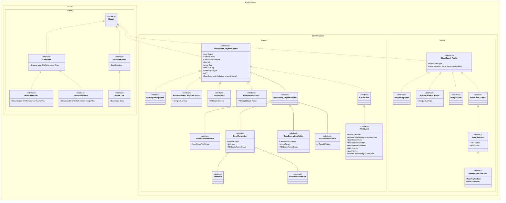

[English](./Tutorial.md) | [中文](./Tutorial.zh-cn.md)

# Table of Contents

- [Project Structure](#project-structure)
- [Level Creation, Opening and Saving](#level-creation-opening-and-saving)
  - [Creating a Level](#creating-a-level)
  - [Opening a Level](#opening-a-level)
  - [Saving a Level](#saving-a-level)
- [Basic Components](#basic-components)
  - [Common Components](#common-components)
    - [Color RDColor](#color-rdcolor)
    - [Geometry Types](#geometry-types)
    - [Range RDRange](#range-rdrange)
  - [Rhythm Doctor Components](#rhythm-doctor-components)
    - [Beat RDBeat](#beat-rdbeat)
    - [Expression RDExpression](#expression-rdexpression)
    - [Other Special Syntax Types](#other-special-syntax-types)
- [Events](#events)
  - [Event System](#event-system)
  - [Finding and Retrieving Events](#finding-and-retrieving-events)
  - [Creating and Modifying Events](#creating-and-modifying-events)
  - [Custom Events](#custom-events)
  - [Event Types and Enums](#event-types-and-enums)
- [Rich Text and Dialogue Components](#rich-text-and-dialogue-components)
- [Easing](#easing)
- [Utilities](#utilities)
  - [Rhythm Doctor](#rhythm-doctor-1)
    - [BeatCalculator](#beatcalculator)
  - [Adofai](#adofai)
- [Examples](#examples)
  - [Merging Audio and Visual Levels](#merging-audio-and-visual-levels)

---

# Project Structure

Namespaces follow the pattern `RhythmBase.[GameType].[Category]`.

- **GameType**: All components for a specific game. Enums are also located here directly.
  - `Global`: Shared components.
  - `RhythmDoctor`: Rhythm Doctor specific components.
  - `Adofai`: A Dance of Fire and Ice specific components.
- **Category**: Further categorization of components within each branch.
  - `Components`: Basic data models.
  - `Constants`: Predefined constants.
  - `Events`: All event data models.
  - `Extensions`: Extension methods.
  - `Utils`: Basic utilities.

# Level Creation, Opening and Saving

## Creating a Level

You can create an empty level, a template level (commonly used for testing), or deserialize directly from a JSON string or `JsonDocument`.

```cs
using RDLevel emptyLevel = [];
using RDLevel defaultLevel = RDLevel.Default;
using RDLevel jsonLevel = RDLevel.FromJsonString(...);
using RDLevel jsonDocumentLevel = RDLevel.FromJsonDocument(...);
```

## Opening a Level

Supports reading levels from file paths, streams, or strings. Formats include `.rdlevel`, `.rdzip`, `.zip`.\
Behavior can be configured during reading. All methods have async overloads.

> It is recommended to use `using` statements to manage level variables, ensuring resources are released and temporary extracted files are cleaned up when leaving the scope.

> When reading from streams, only text formats are currently supported.

```cs
using RhythmBase.RhythmDoctor.Components;

LevelReadSettings settings = new()
{
    // Extract all files
    ZipFileProcessMethod = ZipFileProcessMethod.AllFiles,
    // Record file references
    LoadAssets = true,
    // Handling of inactive events
    InactiveEventsHandling = InactiveEventsHandling.Store,
    // Handling of events that throw exceptions during reading
    UnreadableEventsHandling = UnreadableEventHandling.Store,
};

// Read level file
using RDLevel rdlevel1 = RDLevel.FromFile(@"your\level.rdlevel");
// Read level pack file
using RDLevel rdlevel2 = RDLevel.FromFile(@"your\level.rdzip");
// Read compressed pack with custom settings
using RDLevel rdlevel3 = RDLevel.FromFile(@"your\level.zip", settings);
// Read from stream
using Stream fs = new FileStream(@"your\level.rdlevel", FileMode.Open, FileAccess.Read);
using RDLevel rdlevel4 = RDLevel.FromStream(fs, settings);

// View inactive events from reading results
foreach (var inactiveEvent in settings.InactiveEvents)
    Console.WriteLine($"Inactive Event: {inactiveEvent}");
// View events that threw exceptions during reading
foreach (var unreadableEvent in settings.UnreadableEvents)
    Console.WriteLine($"Unreadable Event: {unreadableEvent}");
```

When reading `.rdzip` or `.zip`, `LevelReadSettings.ZipFileProcessMethod` defaults to `AllFiles`, which extracts level resources to a temporary directory.\
You can customize the temporary directory or clean it up manually:

```cs
// Temporary directory root path, defaults to system temp directory
GlobalSettings.CachePath = "cache";
// Temporary folder name prefix
GlobalSettings.CacheDirectoryPrefix = "MyPrefix";
// Extracted folders will look like "cache/MyPrefixjvm3yxwf.wm2"

// Clean up matching temporary directories according to config
GlobalSettings.ClearCache();
```

## Saving a Level

Supports saving levels to files, streams, or packing them as level packs (`.rdzip`).\
Can also serialize directly to JSON string or `JsonDocument`.

> Missing assets will not throw exceptions.\
> If reading directly from a compressed pack, it is recommended to keep the default `ZipFileProcessMethod.AllFiles` so that the temp directory retains complete assets for repacking.

```cs
// Save as rdlevel file
rdlevel1.SaveToFile(@"your\output1.rdlevel");
// Save as level pack (automatically packs referenced assets)
rdlevel2.SaveToZip(@"your\output2.rdzip");
// Write to stream
rdlevel3.SaveToStream(fs);
// Output JSON string
Console.WriteLine(rdlevel4.ToJsonString());
// Output JsonDocument for dynamic modification
JsonDocument jsonDocument = rdlevel4.ToJsonDocument();
```

`LevelReadSettings` and `LevelWriteSettings` each provide lifecycle events:

| Event | Trigger Timing |
|---|---|
| `BeforeReading` | Before reading level |
| `AfterReading` | After reading level |
| `BeforeWriting` | Before writing level |
| `AfterWriting` | After writing level |

```cs
using RhythmBase.Global.Settings;

LevelWriteSettings settings = new();
settings.AfterWriting += (sender, e) => Console.WriteLine("Level saved!");

rdlevel.SaveToFile(@"your\outLevel.rdlevel", settings);
```

# Basic Components

## Common Components

### Color `RDColor`

### Geometry Types

Types prefixed with `RD` and containing `Point`, `Size`, `Rect`, or `RotatedRect` are planar geometry data types.

| Suffix | Meaning | Example |
|---|---|---|
| `I` | Integer type (all properties are `int`) | `RDPointI.X` |
| `N` | Non-nullable type (all properties are non-nullable) | `RDSizeN.Height` |
| `E` | Expression type (all properties are `RDExpression`) | `RDRectE.Size` |

> `RotatedRect.Angle` is always floating-point and is not constrained by the `I` suffix rule.

### Range `RDRange`

A type representing a beat range, commonly used for event queries.

```cs
using RhythmBase.RhythmDoctor.Components;

var result = rdlevel.InRange(new RDRange(rdlevel.DefaultBeat + 10, null));
```

## Rhythm Doctor Components

### Beat `RDBeat`

`RDBeat` is a struct that caches the following read-only information:

- `BeatOnly`: `float`, total beat count from level start (1-based).
- `Bar` / `Beat`: `int` / `float`, current bar and beat, obtained via deconstruction:
  ```cs
  (int bar, float beat) = someBeat;
  ```
- `TimeSpan`: `TimeSpan`, current time.
- `Bpm`: `float`, current BPM.
- `Cpb`: `int`, current crotchets per bar.

`RDBeat` tries to maintain association with a level, and prioritizes deriving other time units from `BeatOnly`.\
When not associated, cached values are used for calculations.

```cs
RDLevel level = [];

// === Associated with level ===
RDBeat beat1 = new(level.Calculator, 20);
RDBeat beat2 = new(level.Calculator, 3, 5);
RDBeat beat3 = new(level.Calculator, TimeSpan.FromSeconds(15));
RDBeat beat4 = level.Calculator.BeatOf(20);
RDBeat beat5 = level.Calculator.BeatOf(3, 5);
RDBeat beat6 = level.Calculator.BeatOf(TimeSpan.FromSeconds(15));
// Default beat of the level
RDBeat beat7 = level.DefaultBeat;
// Link existing beat to a specified level
RDBeat beat8 = beat1.WithLink(level);
RDBeat beat9 = beat2.WithLinkIfNull(level);

// === Not associated with level ===
RDBeat beat10 = new(20);
RDBeat beat11 = new(3, 5);
RDBeat beat12 = new(TimeSpan.FromSeconds(15));
// Tuple implicit conversion
RDBeat beat13 = (3, 5);
// Detach association
RDBeat beat14 = beat1.WithoutLink();

// === Check association status ===
bool isLinked = !beat13.IsEmpty;
```

When events are added to a level, beat associations are automatically established; when removed, associations are automatically broken.\
When two associated beats participate in operations, they must point to the same level.

```cs
using RhythmBase.RhythmDoctor.Components;

RDBeat beat1 = level.Calculator.BeatOf(1);
RDBeat beat2 = beat1.WithoutLink();

Console.WriteLine(beat1.FromSameLevel(beat2));       // False
Console.WriteLine(beat1.FromSameLevelOrNull(beat2)); // True
```

### Expression `RDExpression`

Used to store Rhythm Doctor expression strings, supporting simple operations (parsing and evaluation not yet completed).\
The underlying implementation uses string concatenation, so多层嵌套括号 appearing after multiple operations is normal behavior.

```cs
using RhythmBase.RhythmDoctor.Components;

RDExpression exp1 = new("i2+1");
RDExpression exp2 = new(30);
RDExpression exp3 = new("25.5");

RDExpression result = exp1 - exp2 * exp3;

Console.WriteLine(result); // i2+1-765
```

### Other Special Syntax Types

```cs
Order order = [2, 0, 3, 1];

RDRoom room = [2, 3];

RDCharacter c1 = RDCharacters.Samurai;
RDCharacter c2 = "custom_character.png";

RoomHeight roomHeight = (20, 30, 10, 40);
```

# Events

## Event System

There are many event types; the following diagram only shows the inheritance relationships of interfaces and base classes.



You can search or filter event types based on the above class diagram.\
All events are `record` types, supporting `with` expressions for cloning, and also provide a `CloneAs<TEvent>()` method for cross-type cloning.

## Finding and Retrieving Events

`RDLevel` inherits from `OrderedEventCollection<IBaseEvent>`, internally using a red-black tree sorted by beat.\
Extension methods allow quick filtering by type, interface, beat range, or custom conditions.

```cs
using RhythmBase.RhythmDoctor.Extensions;
using RhythmBase.RhythmDoctor.Components;

// Filter by type
var moves = rdlevel.OfEvent<MoveRow>();

// Filter by beat range
var inRange = rdlevel.InRange(level.Calculator.BeatOf(3), level.Calculator.BeatOf(5));

// Filter by exact beat
var atBeat = rdlevel.AtBeat(level.Calculator.BeatOf(2, 1));

// Combined condition: MoveRow events in bars 3~5, rows 0~2
var list = rdlevel.OfEvent<MoveRow>()
    .Where(i => 0 <= i.Y && i.Y < 3)
    .InRange(level.Calculator.BeatOf(3), level.Calculator.BeatOf(5));
```

`Row` and `Decoration` also hold event collections internally, so the above extension methods apply to rows and decorations as well.

```cs
// Find Tint events on decoration 0 between beat (11,1) and (13,1)
var list = rdlevel.Decorations[0]
    .OfEvent<Tint>()
    .InRange(new RDBeat(11, 1), new RDBeat(13, 1));
```

Event navigation methods are also provided for locating adjacent events in the ordered collection:

```cs
// Previous event of same type
var prev = someEvent.Before<MoveRow>();
// Next event of same type
var next = someEvent.Next<MoveRow>();
// Nearest event in front
var front = someEvent.Front();
```

## Creating and Modifying Events

All events directly or indirectly implement `IBaseEvent` and inherit from `BaseEvent`.\
Common base classes and interfaces:

- `BaseRowAction`: Row events (e.g., `MoveRow`, `AddClassicBeat`)
- `BaseDecorationAction`: Decoration events (e.g., `Move`, `Tint`)
- `IRoomEvent`: Events with multi-room properties

When creating events, the `Beat` parameter can be unassociated with a level; associations are automatically established when added and broken when removed.\
If no beat is specified, it defaults to beat 1 of the level.

```cs
using RhythmBase.RhythmDoctor.Components;
using RhythmBase.RhythmDoctor.Events;

Comment comment = new() { Beat = new(12), Text = "My_comment." };
Console.WriteLine(comment); // [11,?,?] Comment My_comment.

rdlevel.Add(comment);
Console.WriteLine(comment); // [2,4] Comment My_comment.

rdlevel.Remove(comment);
Console.WriteLine(comment); // [11,?,?] Comment My_comment.
```

When adding, modifying, or removing `SetCrotchetsPerBar` events, the level automatically updates the timeline to ensure other events remain fixed at their absolute beats, while automatically merging or splitting adjacent events with the same CPB to maintain timeline stability.

Row and decoration events must be added via `Add()` on the corresponding row or decoration, but can be removed from any level (level, row, or decoration) via `Remove()`.\
Repeated additions have no effect. `Comment` and `TintRows` are not subject to this restriction and can be added directly to the level.

```cs
using RhythmBase.RhythmDoctor.Components;
using RhythmBase.RhythmDoctor.Events;

using RDLevel rdlevel = RDLevel.Default;

MoveRow tr = new();
Console.WriteLine(rdlevel); // "" Count = 3

rdlevel.Add(new Comment()); // Count unchanged

rdlevel.Rows[0].Add(tr);
Console.WriteLine(rdlevel); // "" Count = 4

rdlevel.Remove(tr);
Console.WriteLine(rdlevel); // "" Count = 3
```

## Custom Events

If built-in event types do not meet your needs, you can inherit from `ForwardEvent` (or `ForwardRowEvent`, `ForwardDecorationEvent`) to implement your own.\
When reading a level, unknown event types are automatically deserialized into the corresponding `ForwardEvent`.

```cs
using Newtonsoft.Json.Linq;
using RhythmBase.RhythmDoctor.Events;
using RhythmBase.RhythmDoctor.Components;

public class MyEvent : ForwardEvent
{
    public RDPointE? MyProperty
    {
        get
        {
            var value = Data["myProperty"];
            return value?.ToObject<RDPointE?>() ?? new RDPointE(0, 0);
        }
        set
        {
            Data["myProperty"] = value.HasValue
                ? new JArray(value?.X ?? null, value?.Y ?? null)
                : null;
        }
    }

    public MyEvent()
    {
        ActualType = nameof(MyEvent);
    }
}
```

Custom events can be read and written like normal events.\
Note that `Type` remains `EventType.ForwardEvent`, while `ActualType` is the custom type name.

```cs
MyEvent myEvent = new();
rdlevel.Add(myEvent);
myEvent.Beat = new(8);

Console.WriteLine(myEvent.Type);       // ForwardEvent
Console.WriteLine(myEvent.ActualType); // MyEvent
```

> When undefined event types are encountered during level reading, they are converted to `ForwardEvent`, `ForwardDecorationEvent`, or `ForwardRowEvent` based on their field characteristics.

If existing events are missing properties, you can directly use index access to get or set property values.\
You can also override existing events to construct a supplemented version of the event model.\
Serialization prioritizes additional fields, so this feature can also be used to override existing serialization logic.

```cs
Comment comment1 = new Comment() { ["extraText"] = JsonElement.Parse("\"hello\"") };
MyComment comment2 = new MyComment() { ExtraText = "hello" };

record MyComment: Comment
{
    public string ExtraText
    {
        get => this["extraText"].GetString() ?? "";
        set => this["extraText"] = JsonElement.Parse($"\"{value}\"");
    }
}
```

## Event Types and Enums

All events have an `EaseType` property. `EventTypeUtils` provides conversion tools between types and enums.

```cs
using RhythmBase.RhythmDoctor.Components;
using RhythmBase.RhythmDoctor.Events;
using RhythmBase.RhythmDoctor.Utils;

Console.WriteLine(EventType.Tint.ToType());
// RhythmBase.Events.Tint

Console.WriteLine(EventTypeUtils.ToType("Tint"));
// RhythmBase.Events.Tint

Console.WriteLine(EventTypeUtils.ToEnum(typeof(Tint)));
// Tint

Console.WriteLine(EventTypeUtils.ToEnum<Tint>());
// Tint

Console.WriteLine(string.Join(", ", EventTypeUtils.ToEnums(typeof(IBarBeginningEvent))));
// PlaySong, SetCrotchetsPerBar, SetHeartExplodeVolume
```

`EventTypeUtils` also provides built-in categorizations:

```cs
using RhythmBase.RhythmDoctor.Utils;

Console.WriteLine(string.Join(",\n", EventTypeUtils.DecorationTypes));
// Comment, ForwardDecorationEvent, Move, PlayAnimation, SetVisible, Tile, Tint

Console.WriteLine(string.Join(",\n", EventTypeUtils.EventTypeEnumsForCameraFX));
// MoveCamera, ShakeScreen, FlipScreen, PulseCamera
```

# Rich Text and Dialogue Components

Rich text components are located in the `RhythmBase.Global.Components.RichText` namespace, supporting the combination of styled text fragments via the `+` operator, with serialization/deserialization capabilities.

- `RDLine<TStyle>`: A complete rich text line.
- `RDPhrase<TStyle>`: A single styled fragment.
- `IRDRichStringStyle<TStyle>`: Style rule interface.

All can be implicitly converted from `string` (resulting in unstyled text).

```cs
using RhythmBase.Global.Components.RichText;

RDLine<RDRichStringStyle> line = RDLine<RDRichStringStyle>.Deserialize("Hel<color=#00FF00>lo");

Console.WriteLine(line.ToString());   // Hello
Console.WriteLine(line.Serialize());  // Hel<color=lime>lo</color>

line += new RDPhrase<RDRichStringStyle>(" Rhythm") { Style = new() { Color = RDColor.Lime } };
line += " Doctor!";

Console.WriteLine(line.ToString());   // Hello Rhythm Doctor!
Console.WriteLine(line.Serialize());  // Hel<color=lime>lo Rhythm</color> Doctor!
```

Supports index access and modification of fragments:

```cs
RDLine<RDRichStringStyle> line = RDLine<RDRichStringStyle>.Deserialize("Hel<color=#00FF00>lo Rhythm</color> Doctor!");

Console.WriteLine(line[6..].ToString());   // Rhythm Doctor!
Console.WriteLine(line[6..].Serialize());  // <color=lime>Rhythm</color> Doctor!

line[5] = " and Welcome to ";

Console.WriteLine(line.ToString());   // Hello and Welcome to Rhythm Doctor!
Console.WriteLine(line.Serialize());  // Hel<color=lime>lo</color> and Welcome to <color=lime>Rhythm</color> Doctor!
```

Additionally provides components adapted to the Rhythm Doctor dialogue format, for modular construction of dialogue text to reduce error rates.

```cs
using RhythmBase.Global.Components.RichText;

RDDialogueExchange exchange =
[
    new RDDialogueBlock
    {
        Character = "Paige",
        Expression = "neutral",
        Content = RDLine<RDDialoguePhraseStyle>.Deserialize("Hel<color=#00FF00>lo [2]<shake>Rhythm</color> Doctor</shake>!"),
    },
    new RDDialogueBlock
    {
        Character = "Ian",
        Content = "Hello Paige!",
    },
    new RDDialogueBlock
    {
        Character = "Paige",
        Expression = "happy",
        Content = new RDPhrase<RDDialoguePhraseStyle>("What a good day!")
        {
            Events =
            [
                new RDDialogueTone(RDDialogueToneType.VerySlow, 6),
                new RDDialogueTone(RDDialogueToneType.Static, 11),
            ],
            Style = new RDDialoguePhraseStyle
            {
                Volume = 0.5f,
                Bold = true,
            },
        }
    }
];

Console.WriteLine(exchange.Serialize());
// Paige_neutral:Hel<color=lime>lo [2]<shake>Rhythm</color> Doctor</shake>!
// Ian:Hello Paige!
// Paige_happy:<volume=0.5><bold>What a[vslow] good[static] day!</volume></bold>
```

# Easing

After importing `RhythmBase.Global.Components.Easing`, you can directly use the `EaseType` enum and quickly calculate eased values via the `Calculate()` extension method.

```cs
using RhythmBase.Global.Components.Easing;

double var1 = EaseType.InSine.Calculate(0.25);
double var2 = EaseType.Linear.Calculate(0.5, 4, 9);

Console.WriteLine(var1); // 0.07612046748871326
Console.WriteLine(var2); // 6.5
```

> Before calling, please confirm the property value type and apply the appropriate type conversion.

```cs
using RhythmBase.Global.Components.Easing;

var result = ((EasePropertyPoint)eases["Position"]).GetValue(level.Calculator.BeatOf(3.2f));

Console.WriteLine(result); // [59.759995, 21.840006]
```

# Utilities

## Rhythm Doctor

### BeatCalculator

Automatically created alongside `RDLevel`, accessed via `RDLevel.Calculator`.\
Used to construct `RDBeat` in an associated state, convert between time units based on the level timeline, and query BPM and CPB at any moment.

```cs
RDLevel level = [];
BeatCalculator calculator = level.Calculator;

Console.WriteLine(calculator.BarBeatToBeatOnly(3, 1));
Console.WriteLine(calculator.BarBeatToTimeSpan(3, 1));
Console.WriteLine(calculator.BeatOnlyToBarBeat(3));
Console.WriteLine(calculator.BeatOnlyToTimeSpan(3));
Console.WriteLine(calculator.TimeSpanToBarBeat(TimeSpan.FromSeconds(3)));
Console.WriteLine(calculator.TimeSpanToBeatOnly(TimeSpan.FromSeconds(3)));

Console.WriteLine(calculator.BeatsPerMinuteOf((3, 1)));
Console.WriteLine(calculator.CrotchetsPerBarOf((3, 1)));
```

Internal cache can be manually refreshed via `BeatCalculator.Refresh()`.

### RDLang Parser (Deprecated Soon)

Provides a `TryRun()` method for executing Rhythm Doctor expressions.\
If the expression is invalid, returns `false` and the result is `0`.

```cs
using RhythmBase.RhythmDoctor.Components.RDLang;

RDLang.Variables.i[1] = 9;

RDLang.TryRun("numMistakesP2 = 3", out float result); // 3
RDLang.TryRun("numMistakesP2+i1", out result);        // 12
RDLang.TryRun("atLeastRank(A)", out result);          // 1
```

This library does not support dynamic level playback, so the following simulation fields are provided:

- `RDVariables.SimulateCurrentRank` — Simulates the level rank for `atLeastRank()`.
- `RDVariables.SimulateAtLeastNPerfectsSuccessRate` — Simulates the hit success rate for `atLeastNPerfects()`.

### Other Utilities

## Adofai

### BeatCalculator (WIP)

Created alongside `ADLevel`, accessed via `ADLevel.Calculator`.

### Other Utilities

# Examples

## Merging Audio and Visual Levels

```cs
using RhythmBase.RhythmDoctor.Components;
using RhythmBase.RhythmDoctor.Events;
using RhythmBase.RhythmDoctor.Extensions;

// Read visual effects level
using RDLevel vfxLevel = RDLevel.FromFile(@"vfx.rdlevel");
// Read audio level
using RDLevel audioLevel = RDLevel.FromFile(@"beat.rdlevel");

// Remove all rows from visual level
foreach (var row in vfxLevel.Rows.ToList())
    vfxLevel.Rows.Remove(row);

// Copy rows from audio level to visual level
foreach (var row in audioLevel.Rows)
{
    Row row2 = new()
    {
        Rooms = row.Rooms,
        Character = row.Character,
        Sound = row.Sound,
        RowType = row.RowType
    };
    vfxLevel.Rows.Add(row2);

    foreach (var evt in row.OfEvent<BaseBeat>())
        row2.Add(evt);
}

// Copy non-row sound events
foreach (var sound in audioLevel.Where(e =>
    e.Tab == Tabs.Sounds &&
    e is not BaseRowAction &&
    e is not PlaySong &&
    e is not SetCrotchetsPerBar))
{
    vfxLevel.Add(sound);
}

// Save result
vfxLevel.SaveToFile(@"result.rdlevel");
```
