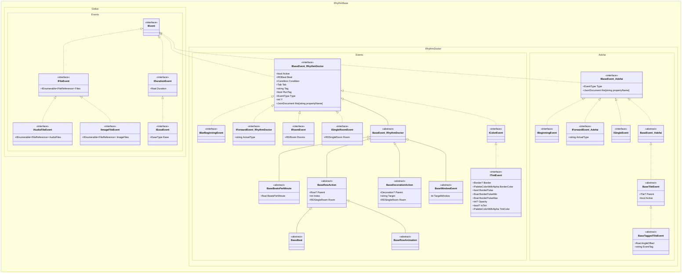

[English](./Tutorial.md) | 中文

# 目录

- [项目结构](#项目结构)
- [关卡的创建、打开与保存](#关卡的创建打开与保存)
  - [创建关卡](#创建关卡)
  - [打开关卡](#打开关卡)
  - [保存关卡](#保存关卡)
- [基础组件](#基础组件)
  - [公共组件](#公共组件)
	- [颜色 RDColor](#颜色-rdcolor)
	- [几何类型](#几何类型)
	- [范围 RDRange](#范围-rdrange)
  - [节奏医生组件](#节奏医生组件)
	- [节拍 RDBeat](#节拍-rdbeat)
	- [表达式 RDExpression](#表达式-rdexpression)
	- [其他特殊语法类型](#其他特殊语法类型)
- [事件](#事件)
  - [事件体系](#事件体系)
  - [查找和获取事件](#查找和获取事件)
  - [创建和增删事件](#创建和增删事件)
  - [自定义事件](#自定义事件)
  - [事件类型与枚举](#事件类型与枚举)
- [富文本和对话组件](#富文本和对话组件)
- [缓动](#缓动)
- [辅助工具](#辅助工具)
  - [节奏医生](#节奏医生-1)
	- [节拍计算器 BeatCalculator](#节拍计算器-beatcalculator)
  - [冰与火之舞](#冰与火之舞)
- [案例](#案例)
  - [合并采音关卡与视效关卡](#合并采音关卡与视效关卡)

---

# 项目结构

命名空间统一为 `RhythmBase.[游戏类型].[综合类型]`。

- **游戏类型**：针对特定游戏的全部组件，枚举类型也直接位于此处。
  - `Global`：公共组件。
  - `RhythmDoctor`：节奏医生专用组件。
  - `Adofai`：冰与火之舞专用组件。
- **综合类型**：对各分支组件的进一步归类。
  - `Components`：基本数据模型。
  - `Constants`：预定义常量。
  - `Events`：所有事件的数据模型。
  - `Extensions`：扩展方法。
  - `Utils`：基础工具。

# 关卡的创建、打开与保存

## 创建关卡

可以创建空关卡、模板关卡（常用于测试），也可以直接从 JSON 字符串或 `JsonDocument` 反序列化关卡。

```cs
using RDLevel emptyLevel = [];
using RDLevel defaultLevel = RDLevel.Default;
using RDLevel jsonLevel = RDLevel.FromJsonString(...);
using RDLevel jsonDocumentLevel = RDLevel.FromJsonDocument(...);
```

## 打开关卡

支持从文件路径、流或字符串读取关卡，格式包括 `.rdlevel`、`.rdzip`、`.zip`。\
读取时可指定行为配置，所有方法均提供异步重载。

> 建议使用 `using` 语句管理关卡变量，以确保在离开作用域时释放资源并清理临时解压文件。

> 从流读取时，目前仅支持文本格式。

```cs
using RhythmBase.RhythmDoctor.Components;

LevelReadSettings settings = new()
{
	// 解压所有文件
	ZipFileProcessMethod = ZipFileProcessMethod.AllFiles,
	// 记录文件引用
	LoadAssets = true,
	// 禁用事件的处理方式
	InactiveEventsHandling = InactiveEventsHandling.Store,
	// 读取异常事件的处理方式
	UnreadableEventsHandling = UnreadableEventHandling.Store,
};

// 读取关卡文件
using RDLevel rdlevel1 = RDLevel.FromFile(@"your\level.rdlevel");
// 读取关卡包文件
using RDLevel rdlevel2 = RDLevel.FromFile(@"your\level.rdzip");
// 使用自定义配置读取压缩包
using RDLevel rdlevel3 = RDLevel.FromFile(@"your\level.zip", settings);
// 从流中读取
using Stream fs = new FileStream(@"your\level.rdlevel", FileMode.Open, FileAccess.Read);
using RDLevel rdlevel4 = RDLevel.FromStream(fs, settings);

// 查看被禁用的事件
foreach (var inactiveEvent in settings.InactiveEvents)
	Console.WriteLine($"Inactive Event: {inactiveEvent}");
// 查看读取异常的事件
foreach (var unreadableEvent in settings.UnreadableEvents)
	Console.WriteLine($"Unreadable Event: {unreadableEvent}");
```

读取 `.rdzip` 或 `.zip` 时，`LevelReadSettings.ZipFileProcessMethod` 默认为 `AllFiles`，会将关卡资源解压到临时目录。\
可通过以下方式自定义临时目录或手动清理：

```cs
// 临时目录根路径，默认为系统临时目录
GlobalSettings.CachePath = "cache";
// 临时文件夹名前缀
GlobalSettings.CacheDirectoryPrefix = "MyPrefix";
// 解压后的文件夹类似 "cache/MyPrefixjvm3yxwf.wm2"

// 按配置清理匹配的临时目录
GlobalSettings.ClearCache();
```

## 保存关卡

支持将关卡保存到文件、流，或打包为关卡包（`.rdzip`）。\
也可直接序列化为 JSON 字符串或 `JsonDocument`。

> 缺失素材不会抛出异常。\
> 若从压缩包直接读取，建议保持默认的 `ZipFileProcessMethod.AllFiles`，以便临时目录中保留完整素材供打包复用。

```cs
// 保存为 rdlevel 文件
rdlevel1.SaveToFile(@"your\output1.rdlevel");
// 保存为关卡包（自动打包引用到的素材）
rdlevel2.SaveToZip(@"your\output2.rdzip");
// 写入流
rdlevel3.SaveToStream(fs);
// 输出 JSON 字符串
Console.WriteLine(rdlevel4.ToJsonString());
// 输出 JsonDocument，便于动态修改
JsonDocument jsonDocument = rdlevel4.ToJsonDocument();
```

`LevelReadSettings` 和 `LevelWriteSettings` 分别提供了生命周期事件：

| 事件 | 触发时机 |
|---|---|
| `BeforeReading` | 读取关卡前 |
| `AfterReading` | 读取关卡后 |
| `BeforeWriting` | 写入关卡前 |
| `AfterWriting` | 写入关卡后 |

```cs
using RhythmBase.Global.Settings;

LevelWriteSettings settings = new();
settings.AfterWriting += (sender, e) => Console.WriteLine("Level saved!");

rdlevel.SaveToFile(@"your\outLevel.rdlevel", settings);
```

# 基础组件

## 公共组件

### 颜色 `RDColor`

### 几何类型

以 `RD` 为前缀，名称包含 `Point`、`Size`、`Rect`、`RotatedRect` 的类型均为平面几何数据类型。

| 后缀 | 含义 | 示例 |
|---|---|---|
| `I` | 整数类型（所有属性为 `int`） | `RDPointI.X` |
| `N` | 非空类型（所有属性不可空） | `RDSizeN.Height` |
| `E` | 表达式类型（所有属性为 `RDExpression`） | `RDRectE.Size` |

> `RotatedRect` 的 `Angle` 始终为浮点型，不受 `I` 后缀规则约束。

### 范围 `RDRange`

表示节拍范围的类型，常用于事件查询。

```cs
using RhythmBase.RhythmDoctor.Components;

var result = rdlevel.InRange(new RDRange(rdlevel.DefaultBeat + 10, null));
```

## 节奏医生组件

### 节拍 `RDBeat`

`RDBeat` 是一个结构体，缓存了以下只读信息：

- `BeatOnly`：`float`，从关卡起始算起的总节拍数（从 1 开始）。
- `Bar` / `Beat`：`int` / `float`，当前所在小节与拍数，通过解构获取：
  ```cs
  (int bar, float beat) = someBeat;
  ```
- `TimeSpan`：`TimeSpan`，当前时刻。
- `Bpm`：`float`，当前 BPM。
- `Cpb`：`int`，当前每小节四分音符数。

`RDBeat` 会尽量与关卡保持关联，并优先通过 `BeatOnly` 推算其他时间单位。\
无关联时则使用缓存值参与计算。

```cs
RDLevel level = [];

// === 与关卡关联 ===
RDBeat beat1 = new(level.Calculator, 20);
RDBeat beat2 = new(level.Calculator, 3, 5);
RDBeat beat3 = new(level.Calculator, TimeSpan.FromSeconds(15));
RDBeat beat4 = level.Calculator.BeatOf(20);
RDBeat beat5 = level.Calculator.BeatOf(3, 5);
RDBeat beat6 = level.Calculator.BeatOf(TimeSpan.FromSeconds(15));
// 关卡默认节拍
RDBeat beat7 = level.DefaultBeat;
// 将已有节拍链接到指定关卡
RDBeat beat8 = beat1.WithLink(level);
RDBeat beat9 = beat2.WithLinkIfNull(level);

// === 不与关卡关联 ===
RDBeat beat10 = new(20);
RDBeat beat11 = new(3, 5);
RDBeat beat12 = new(TimeSpan.FromSeconds(15));
// 使用元组隐式转换
RDBeat beat13 = (3, 5);
// 断开关联
RDBeat beat14 = beat1.WithoutLink();

// === 检查关联状态 ===
bool isLinked = !beat13.IsEmpty;
```

事件被添加至关卡时会自动建立节拍关联，移除时自动断开。\
两个有关联的节拍参与运算时，需确保指向同一关卡。

```cs
using RhythmBase.RhythmDoctor.Components;

RDBeat beat1 = level.Calculator.BeatOf(1);
RDBeat beat2 = beat1.WithoutLink();

Console.WriteLine(beat1.FromSameLevel(beat2));       // False
Console.WriteLine(beat1.FromSameLevelOrNull(beat2)); // True
```

### 表达式 `RDExpression`

用于存储节奏医生表达式字符串，支持简单运算（解析与求值功能尚未完成）。\
底层采用字符串拼接，因此多次运算后出现多层嵌套括号属于正常现象。

```cs
using RhythmBase.RhythmDoctor.Components;

RDExpression exp1 = new("i2+1");
RDExpression exp2 = new(30);
RDExpression exp3 = new("25.5");

RDExpression result = exp1 - exp2 * exp3;

Console.WriteLine(result); // i2+1-765
```

### 其他特殊语法类型

```cs
Order order = [2, 0, 3, 1];

RDRoom room = [2, 3];

RDCharacter c1 = RDCharacters.Samurai;
RDCharacter c2 = "custom_character.png";

RoomHeight roomHeight = (20, 30, 10, 40);
```

# 事件

## 事件体系

事件类型众多，下图仅列出接口与基类的继承关系。



可根据上述类图检索或筛选事件类型。\
所有事件均为 `record` 类型，支持 `with` 表达式复制实例，也提供 `CloneAs<TEvent>()` 方法用于跨类型克隆。

## 查找和获取事件

`RDLevel` 继承自 `OrderedEventCollection<IBaseEvent>`，内部使用红黑树按节拍排序。\
可通过扩展方法按类型、接口、节拍范围或自定义条件快速筛选事件。

```cs
using RhythmBase.RhythmDoctor.Extensions;
using RhythmBase.RhythmDoctor.Components;

// 按类型筛选
var moves = rdlevel.OfEvent<MoveRow>();

// 按节拍范围筛选
var inRange = rdlevel.InRange(level.Calculator.BeatOf(3), level.Calculator.BeatOf(5));

// 按精确节拍筛选
var atBeat = rdlevel.AtBeat(level.Calculator.BeatOf(2, 1));

// 组合条件：第 3~5 小节、事件栏第 0~2 行的 MoveRow
var list = rdlevel.OfEvent<MoveRow>()
	.Where(i => 0 <= i.Y && i.Y < 3)
	.InRange(level.Calculator.BeatOf(3), level.Calculator.BeatOf(5));
```

`Row` 与 `Decoration` 内部同样持有事件集合，因此上述扩展方法对轨道和精灵也适用。

```cs
// 查找精灵 0 上第 11 小节第 1 拍到第 13 小节第 1 拍之间的 Tint 事件
var list = rdlevel.Decorations[0]
	.OfEvent<Tint>()
	.InRange(new RDBeat(11, 1), new RDBeat(13, 1));
```

此外还提供事件导航方法，用于在有序集合中定位相邻事件：

```cs
// 同类型前一个事件
var prev = someEvent.Before<MoveRow>();
// 同类型后一个事件
var next = someEvent.Next<MoveRow>();
// 前方最近的任意事件
var front = someEvent.Front();
```

## 创建和增删事件

所有事件均直接或间接实现 `IBaseEvent` 并继承 `BaseEvent`。\
常见基类与接口：

- `BaseRowAction`：轨道事件（如 `MoveRow`、`AddClassicBeat`）
- `BaseDecorationAction`：精灵事件（如 `Move`、`Tint`）
- `IRoomEvent`：具有多房间属性的事件

创建事件时，`Beat` 参数可以与关卡无关联；事件加入关卡后自动建立关联，移除后自动断开。\
未指定节拍时，默认为关卡第 1 拍。

```cs
using RhythmBase.RhythmDoctor.Components;
using RhythmBase.RhythmDoctor.Events;

Comment comment = new() { Beat = new(12), Text = "My_comment." };
Console.WriteLine(comment); // [11,?,?] Comment My_comment.

rdlevel.Add(comment);
Console.WriteLine(comment); // [2,4] Comment My_comment.

rdlevel.Remove(comment);
Console.WriteLine(comment); // [11,?,?] Comment My_comment.
```

添加、修改或移除 `SetCrotchetsPerBar` 事件时，关卡会自动更新时间线，确保其他事件按绝对节拍固定不动，同时会自动合并或拆分相邻的相同 CPB 事件以维持时间线稳定。

轨道事件和精灵事件需在对应轨道或精灵上调用 `Add()`，移除则可在任意层级（关卡、轨道、精灵）调用 `Remove()`。\
重复添加不会产生效果。`Comment` 和 `TintRows` 不受此限制，可直接添加至关卡。

```cs
using RhythmBase.RhythmDoctor.Components;
using RhythmBase.RhythmDoctor.Events;

using RDLevel rdlevel = RDLevel.Default;

MoveRow tr = new();
Console.WriteLine(rdlevel); // "" Count = 3

rdlevel.Add(new Comment()); // Count 不变

rdlevel.Rows[0].Add(tr);
Console.WriteLine(rdlevel); // "" Count = 4

rdlevel.Remove(tr);
Console.WriteLine(rdlevel); // "" Count = 3
```

## 自定义事件

若内置事件类型不满足需求，可继承 `ForwardEvent`（或 `ForwardRowEvent`、`ForwardDecorationEvent`）自行实现。\
读取关卡时遇到未知类型的事件，也会被自动反序列化为对应的 `ForwardEvent`。

```cs
using Newtonsoft.Json.Linq;
using RhythmBase.RhythmDoctor.Events;
using RhythmBase.RhythmDoctor.Components;

public class MyEvent : ForwardEvent
{
	public RDPointE? MyProperty
	{
		get
		{
			var value = Data["myProperty"];
			return value?.ToObject<RDPointE?>() ?? new RDPointE(0, 0);
		}
		set
		{
			Data["myProperty"] = value.HasValue
				? new JArray(value?.X ?? null, value?.Y ?? null)
				: null;
		}
	}

	public MyEvent()
	{
		ActualType = nameof(MyEvent);
	}
}
```

自定义事件可像普通事件一样读写。\
注意其 `Type` 仍为 `EventType.ForwardEvent`，而 `ActualType` 才是自定义类型名。

```cs
MyEvent myEvent = new();
rdlevel.Add(myEvent);
myEvent.Beat = new(8);

Console.WriteLine(myEvent.Type);       // ForwardEvent
Console.WriteLine(myEvent.ActualType); // MyEvent
```

> 当读取关卡过程中遇到未定义的事件类型，将会依据字段特点转换为 `ForwardEvent`、`ForwardDecorationEvent` 或 `ForwardRowEvent`。

如果既有事件缺失属性，可以直接使用索引访问以获取或设置属性的值。\
也可以重写既有事件以构造一个补充版本的事件模型。
序列化时会优先使用额外的字段，所以也可以使用此功能覆盖现有序列化逻辑。

```cs
Comment comment1 = new Comment() { ["extraText"] = JsonElement.Parse("\"hello\"") };
MyComment comment2 = new MyComment() { ExtraText = "hello" };

record MyComment: Comment
{
	public string ExtraText
	{
		get => this["extraText"].GetString() ?? "";
		set => this["extraText"] = JsonElement.Parse($"\"{value}\"");
	}
}
```

## 事件类型与枚举

所有事件均具有 `EaseType` 属性。`EventTypeUtils` 提供了类型与枚举之间的转换工具。

```cs
using RhythmBase.RhythmDoctor.Components;
using RhythmBase.RhythmDoctor.Events;
using RhythmBase.RhythmDoctor.Utils;

Console.WriteLine(EventType.Tint.ToType());
// RhythmBase.Events.Tint

Console.WriteLine(EventTypeUtils.ToType("Tint"));
// RhythmBase.Events.Tint

Console.WriteLine(EventTypeUtils.ToEnum(typeof(Tint)));
// Tint

Console.WriteLine(EventTypeUtils.ToEnum<Tint>());
// Tint

Console.WriteLine(string.Join(", ", EventTypeUtils.ToEnums(typeof(IBarBeginningEvent))));
// PlaySong, SetCrotchetsPerBar, SetHeartExplodeVolume
```

`EventTypeUtils` 还内置了常用分类：

```cs
using RhythmBase.RhythmDoctor.Utils;

Console.WriteLine(string.Join(",\n", EventTypeUtils.DecorationTypes));
// Comment, ForwardDecorationEvent, Move, PlayAnimation, SetVisible, Tile, Tint

Console.WriteLine(string.Join(",\n", EventTypeUtils.EventTypeEnumsForCameraFX));
// MoveCamera, ShakeScreen, FlipScreen, PulseCamera
```

# 富文本和对话组件

富文本位于 `RhythmBase.Global.Components.RichText` 命名空间，支持通过 `+` 运算符组合带样式的文本片段，并提供序列化/反序列化能力。

- `RDLine<TStyle>`：完整的富文本行。
- `RDPhrase<TStyle>`：单个样式片段。
- `IRDRichStringStyle<TStyle>`：样式规则接口。

均可从 `string` 隐式转换（转换后为无样式文本）。

```cs
using RhythmBase.Global.Components.RichText;

RDLine<RDRichStringStyle> line = RDLine<RDRichStringStyle>.Deserialize("Hel<color=#00FF00>lo");

Console.WriteLine(line.ToString());   // Hello
Console.WriteLine(line.Serialize());  // Hel<color=lime>lo</color>

line += new RDPhrase<RDRichStringStyle>(" Rhythm") { Style = new() { Color = RDColor.Lime } };
line += " Doctor!";

Console.WriteLine(line.ToString());   // Hello Rhythm Doctor!
Console.WriteLine(line.Serialize());  // Hel<color=lime>lo Rhythm</color> Doctor!
```

支持通过索引访问和修改片段：

```cs
RDLine<RDRichStringStyle> line = RDLine<RDRichStringStyle>.Deserialize("Hel<color=#00FF00>lo Rhythm</color> Doctor!");

Console.WriteLine(line[6..].ToString());   // Rhythm Doctor!
Console.WriteLine(line[6..].Serialize());  // <color=lime>Rhythm</color> Doctor!

line[5] = " and Welcome to ";

Console.WriteLine(line.ToString());   // Hello and Welcome to Rhythm Doctor!
Console.WriteLine(line.Serialize());  // Hel<color=lime>lo</color> and Welcome to <color=lime>Rhythm</color> Doctor!
```

此外还提供适配节奏医生对话格式的组件，用于模块化构建对话文本，降低出错概率。

```cs
using RhythmBase.Global.Components.RichText;

RDDialogueExchange exchange =
[
	new RDDialogueBlock
	{
		Character = "Paige",
		Expression = "neutral",
		Content = RDLine<RDDialoguePhraseStyle>.Deserialize("Hel<color=#00FF00>lo [2]<shake>Rhythm</color> Doctor</shake>!"),
	},
	new RDDialogueBlock
	{
		Character = "Ian",
		Content = "Hello Paige!",
	},
	new RDDialogueBlock
	{
		Character = "Paige",
		Expression = "happy",
		Content = new RDPhrase<RDDialoguePhraseStyle>("What a good day!")
		{
			Events =
			[
				new RDDialogueTone(RDDialogueToneType.VerySlow, 6),
				new RDDialogueTone(RDDialogueToneType.Static, 11),
			],
			Style = new RDDialoguePhraseStyle
			{
				Volume = 0.5f,
				Bold = true,
			},
		}
	}
];

Console.WriteLine(exchange.Serialize());
// Paige_neutral:Hel<color=lime>lo [2]<shake>Rhythm</color> Doctor</shake>!
// Ian:Hello Paige!
// Paige_happy:<volume=0.5><bold>What a[vslow] good[static] day!</volume></bold>
```

# 缓动

引入 `RhythmBase.Global.Components.Easing` 后，可直接使用 `EaseType` 枚举，并通过扩展方法 `Calculate()` 快速计算缓动值。

```cs
using RhythmBase.Global.Components.Easing;

double var1 = EaseType.InSine.Calculate(0.25);
double var2 = EaseType.Linear.Calculate(0.5, 4, 9);

Console.WriteLine(var1); // 0.07612046748871326
Console.WriteLine(var2); // 6.5
```

> 调用前请先确认属性的值类型，并做相应的类型转换。

```cs
using RhythmBase.Global.Components.Easing;

var result = ((EasePropertyPoint)eases["Position"]).GetValue(level.Calculator.BeatOf(3.2f));

Console.WriteLine(result); // [59.759995, 21.840006]
```

# 辅助工具

## 节奏医生

### 节拍计算器 `BeatCalculator`

伴随 `RDLevel` 自动创建，通过 `RDLevel.Calculator` 访问。\
用于构造关联状态的 `RDBeat`，以及在关卡时间轴基础上转换各种时间单位，也可查询任意时刻的 BPM 与 CPB。

```cs
RDLevel level = [];
BeatCalculator calculator = level.Calculator;

Console.WriteLine(calculator.BarBeatToBeatOnly(3, 1));
Console.WriteLine(calculator.BarBeatToTimeSpan(3, 1));
Console.WriteLine(calculator.BeatOnlyToBarBeat(3));
Console.WriteLine(calculator.BeatOnlyToTimeSpan(3));
Console.WriteLine(calculator.TimeSpanToBarBeat(TimeSpan.FromSeconds(3)));
Console.WriteLine(calculator.TimeSpanToBeatOnly(TimeSpan.FromSeconds(3)));

Console.WriteLine(calculator.BeatsPerMinuteOf((3, 1)));
Console.WriteLine(calculator.CrotchetsPerBarOf((3, 1)));
```

可通过 `BeatCalculator.Refresh()` 手动刷新内部缓存。

### RDCode 解析器 `RDLang` (即将弃用)

提供 `TryRun()` 方法执行节奏医生表达式。\
若表达式有误，返回 `false` 且结果为 `0`。

```cs
using RhythmBase.RhythmDoctor.Components.RDLang;

RDLang.Variables.i[1] = 9;

RDLang.TryRun("numMistakesP2 = 3", out float result); // 3
RDLang.TryRun("numMistakesP2+i1", out result);        // 12
RDLang.TryRun("atLeastRank(A)", out result);          // 1
```

本库不支持动态播放关卡，因此提供以下模拟字段：

- `RDVariables.SimulateCurrentRank` — 模拟 `atLeastRank()` 的关卡评级。
- `RDVariables.SimulateAtLeastNPerfectsSuccessRate` — 模拟 `atLeastNPerfects()` 的击拍成功率。

### 其他工具

## 冰与火之舞

### 节拍计算器 `BeatCalculator`（WIP）

伴随 `ADLevel` 创建，通过 `ADLevel.Calculator` 访问。

### 其他工具

# 案例

## 合并采音关卡与视效关卡

```cs
using RhythmBase.RhythmDoctor.Components;
using RhythmBase.RhythmDoctor.Events;
using RhythmBase.RhythmDoctor.Extensions;

// 读取视效关卡
using RDLevel vfxLevel = RDLevel.FromFile(@"vfx.rdlevel");
// 读取采音关卡
using RDLevel audioLevel = RDLevel.FromFile(@"beat.rdlevel");

// 移除视效关卡的所有轨道
foreach (var row in vfxLevel.Rows.ToList())
	vfxLevel.Rows.Remove(row);

// 将采音关卡的轨道复制到视效关卡
foreach (var row in audioLevel.Rows)
{
	Row row2 = new()
	{
		Rooms = row.Rooms,
		Character = row.Character,
		Sound = row.Sound,
		RowType = row.RowType
	};
	vfxLevel.Rows.Add(row2);

	foreach (var evt in row.OfEvent<BaseBeat>())
		row2.Add(evt);
}

// 复制音效栏中的非轨道事件
foreach (var sound in audioLevel.Where(e =>
	e.Tab == Tabs.Sounds &&
	e is not BaseRowAction &&
	e is not PlaySong &&
	e is not SetCrotchetsPerBar))
{
	vfxLevel.Add(sound);
}

// 保存结果
vfxLevel.SaveToFile(@"result.rdlevel");
```